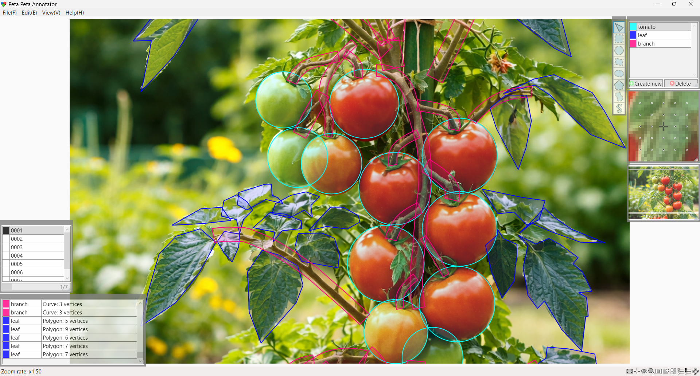
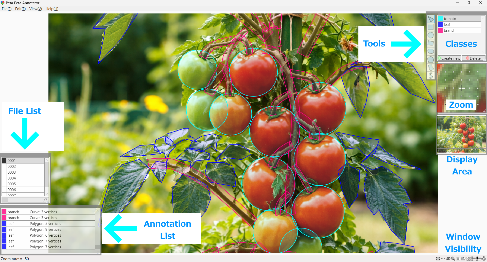
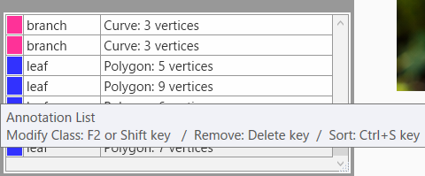
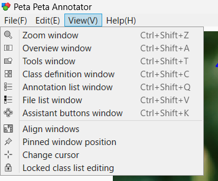

# Peta Peta Annotator

## Language

[English](README.md)
[日本語](README_JP.md)

## Concept

This software is a graphical annotation tool developed to streamline data collection in AI development, particularly image annotation, which remains one of the most significant challenges in the field. It is designed to be usable even by individuals with no knowledge of AI.

## Intuitive Operation

The tool features an intuitive interface that allows users to begin working immediately without specialized AI expertise. Installation is simple, enabling quick deployment in various environments.

It supports a wide range of annotation formats, including rectangles, circles, rotated rectangles, ellipses, polygons, closed curves, and freeform curve paths for segmentation.

Segmentation tasks can be completed entirely with a mouse. The control scheme is straightforward: left-click to add points, right-click to confirm, and press the mouse wheel to cancel. This simple interaction model reduces training time and improves efficiency.

## Standalone Operation

The software operates entirely in a local environment. Because no external servers are required, it can be safely used in environments handling sensitive or confidential data.

## Auto-Save

All annotation work is automatically saved each time an annotation is confirmed, minimizing the risk of data loss in the event of unexpected issues.

## Sub Windows and Utilities

The software includes practical features necessary for professional workflows, such as class configuration, file list and annotation list displays, a magnifier tool, adjustable viewing areas, and on-screen key display support.　The operating instructions will appear when you hover your mouse over it.

## Output Formats

Supported output formats include XML, CSV, and PNG (segmentation masks either merged across classes or separated by class). XML files can be compressed into a ZIP archive using a built-in function within the software.

  
  
  

## Interface Language

The interface support English. 

  

## Workflow

In practical operation, the requester provides images and segmentation specifications to the operator. The operator performs annotation using this software.

The completed deliverables are submitted as ZIP-compressed XML files generated within the software.

This tool prioritizes usability and operational efficiency, providing a practical and streamlined annotation environment for real-world AI development.

  

## Trial version available

Before purchasing the full version, please test it with the free trial version to ensure compatibility.