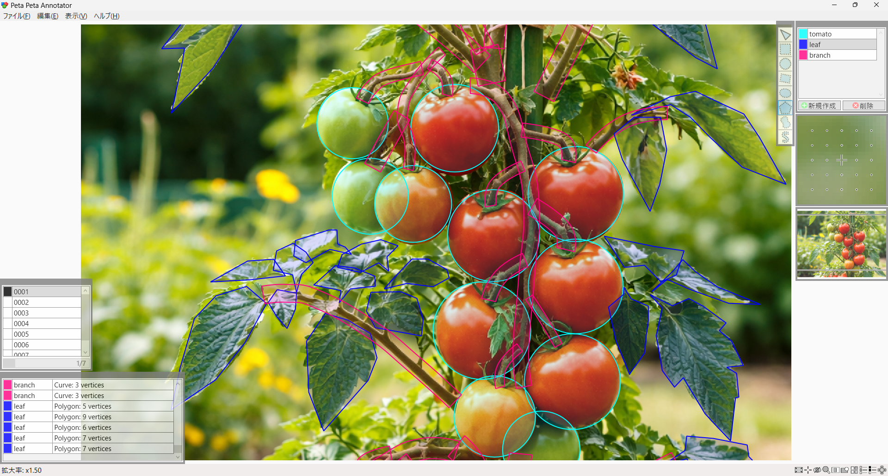
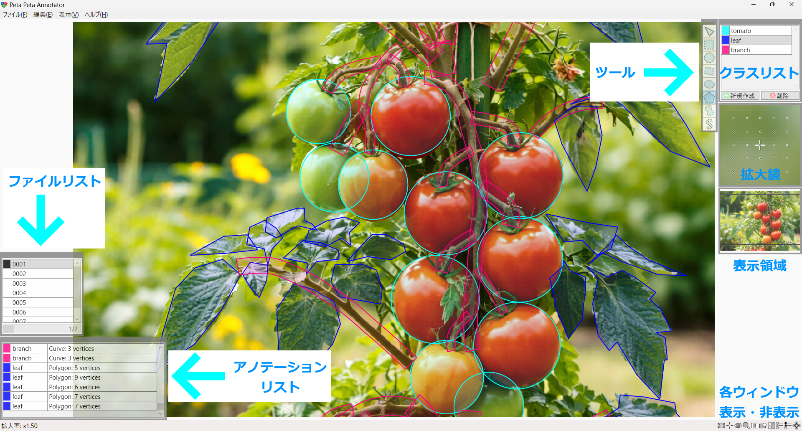
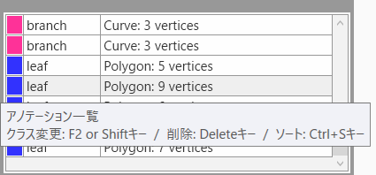
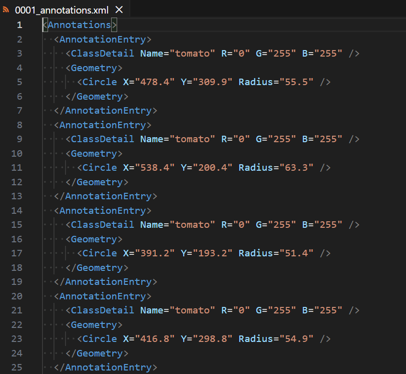
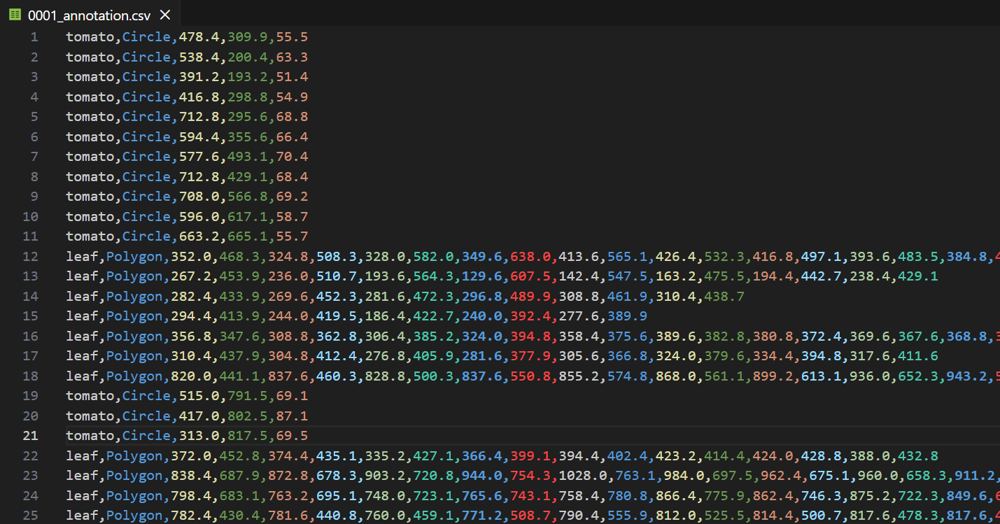
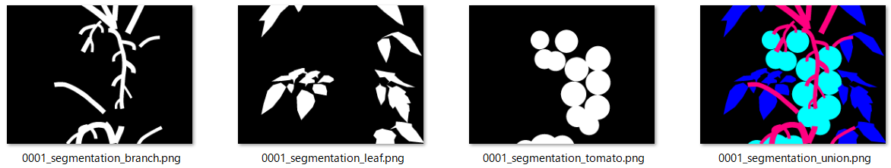
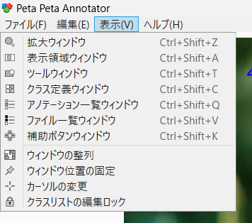
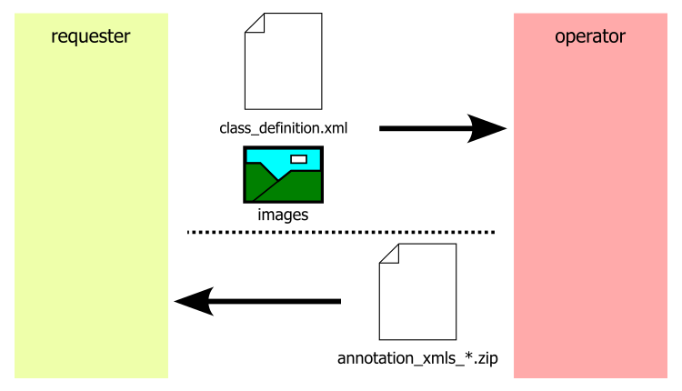

# Peta Peta Annotator

## 言語

[English](README.md)
[日本語](README_JP.md)

## コンセプト

本ソフトウェアは、AI開発において大きな課題となっているデータ収集、とりわけ画像アノテーション作業を効率化するために開発された、AIが分からなくても使える、グラフィカルなアノテーションツールです。

## 直感操作

AIの専門知識がなくても直感的に操作できる設計となっており、インストールも容易で、誰でもすぐに作業を開始できます。

対応するアノテーション形式は、矩形、円形、傾き付き矩形、楕円、多角形、閉曲線、曲線パスによるセグメンテーションと多岐にわたります。

セグメンテーション操作は基本的にマウスのみで完結し、左クリックで点を追加、右クリックで確定、ホイール押し下げでキャンセルといった分かりやすい操作体系を採用しています。

## スタンドアロン動作

完全ローカル環境で動作するため、機密データを扱う現場でも安心して利用できます。

## オートセーブ

作業内容はアノテーション確定ごとに自動保存されるため、万が一のトラブル時にも安心です。

## サブウィンドウ

クラス設定機能、ファイルリストおよびアノテーションリスト表示、拡大鏡、表示領域調整、スクリーンキー表示など、実務に必要な機能を網羅しています。操作方法はマウスホバーしていると表示されます。

## 出力形式

出力形式はXML、CSV、PNG（領域マスク：クラス統合またはクラス別）に対応し、XMLファイルはソフトウェア内機能でZip圧縮することが可能です。

  
  
  

## 表示言語

表示言語は日本語と英語に対応しており、日本語ネイティブによって設計された自然なUIで、違和感なく操作できます。

  

## 運用面

運用面では、依頼者が画像およびセグメンテーション仕様を作業者へ提供し、作業者は本ソフトウェアを用いてアノテーションを実施します。

完成した成果物は、XMLファイルをZip圧縮のうえ提出する流れとなります。

現場の実用性と操作性を重視した、効率的なアノテーション環境を提供するツールです。

  

## 無料試用版あり

正規版を購入される際は、事前に無料試用版での動作確認を推奨いたします。